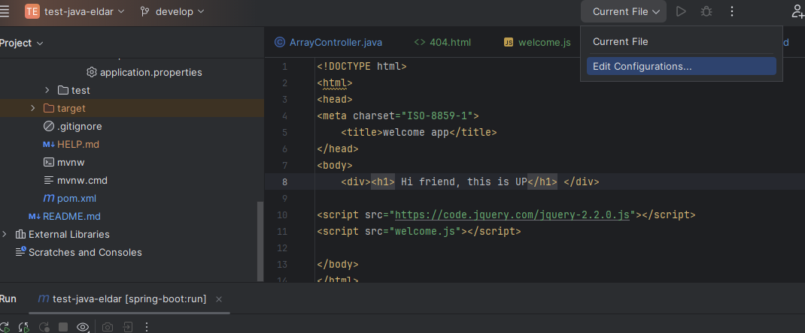
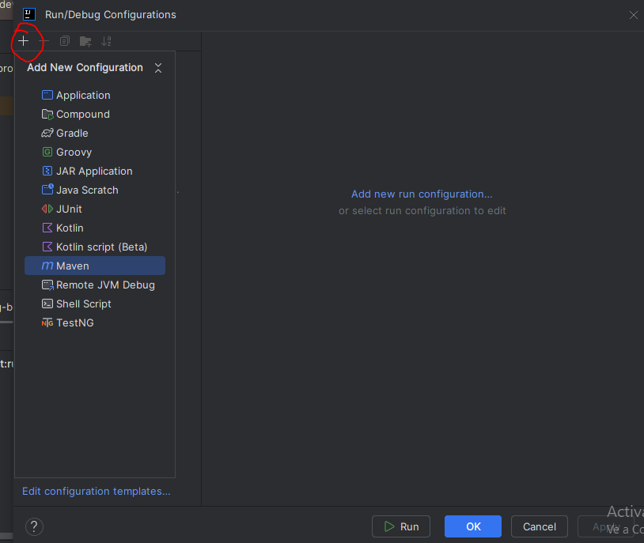
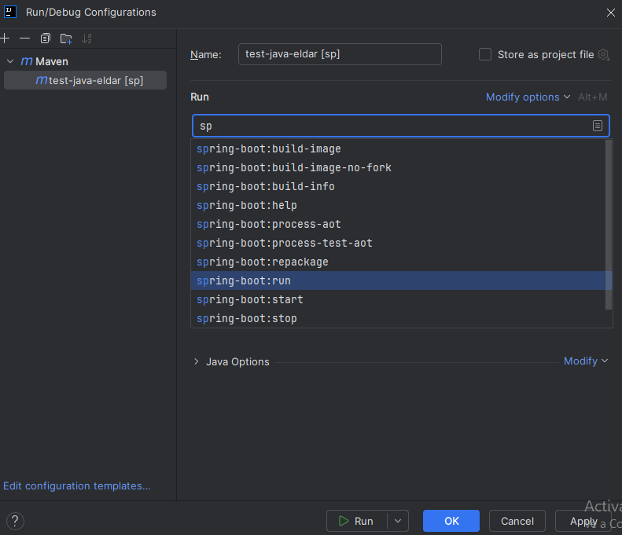

My readme

swagger imp
http://localhost:9191/swagger-ui/index.html

## How to run local

If the project is downloaded, open the proyect with a IDE (this is Intellij) go to option "Edit Configurations..."

Then clic plus and select maven proyect

In the popup type spring-boot:run and select the option run.
Finally apply and run

if this is up , you can call in the broser http://localhost:9191/analyzer/ping

and this response Pong!